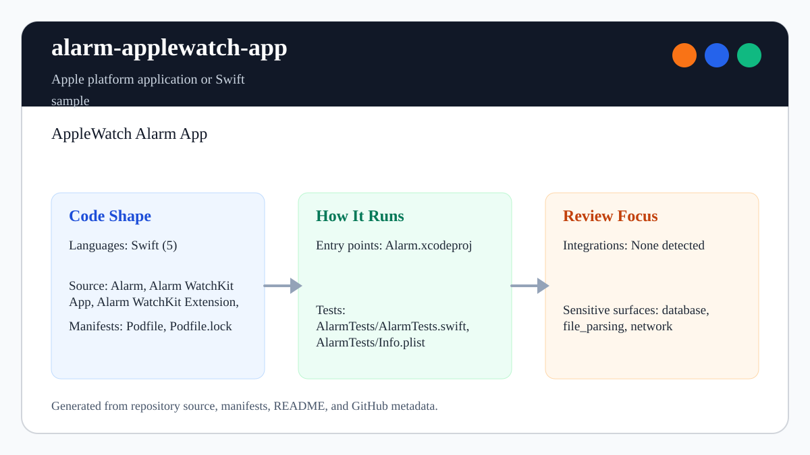
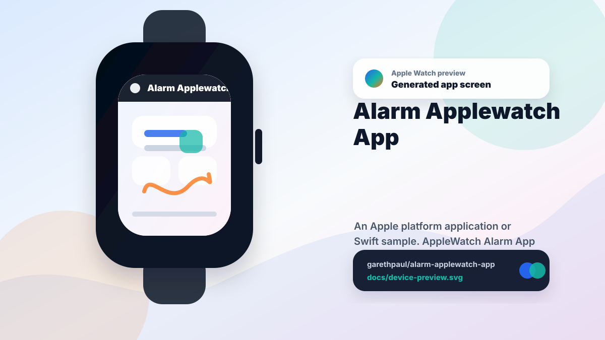

# alarm-applewatch-app

<!-- README-OVERVIEW-IMAGE -->


## Device Preview

<!-- DEVICE-PREVIEW-IMAGE -->


## Overview

`garethpaul/alarm-applewatch-app` is an Apple platform application or Swift sample. AppleWatch Alarm App

This README is based on the checked-in source, manifests, scripts, and repository metadata on the `master` branch. The project language mix found during review was: Swift (5).

## Repository Contents

- `README.md` - project overview and local usage notes
- `Podfile` - Apple platform dependency metadata
- `Alarm` - source or example code
- `Alarm WatchKit App` - source or example code
- `Alarm WatchKit Extension` - source or example code
- `Alarm.xcodeproj` - Xcode project file
- `AlarmTests` - source or example code
- `docs` - source or example code
- `Podfile.lock` - Apple platform dependency metadata
- `SECURITY.md` - security reporting and disclosure guidance
- `VISION.md` - project direction and maintenance guardrails

Additional scan context:

- Source directories: Alarm, Alarm WatchKit App, Alarm WatchKit Extension, AlarmTests, docs
- Dependency and build manifests: Podfile, Podfile.lock
- Entry points or build surfaces: Alarm.xcodeproj
- Test-looking files: AlarmTests/AlarmTests.swift, AlarmTests/Info.plist

## Getting Started

### Prerequisites

- Git
- macOS with Xcode for building Apple platform projects
- CocoaPods if dependencies need to be installed

### Setup

```bash
git clone https://github.com/garethpaul/alarm-applewatch-app.git
cd alarm-applewatch-app
pod install
```

The setup commands above are derived from repository files. Legacy mobile, Python, or JavaScript samples may require older SDKs or package versions than a modern workstation uses by default.

## Running or Using the Project

- Open `Alarm.xcworkspace` in Xcode, choose the app or sample scheme, and run it on the matching simulator/device.

## Testing and Verification

- `make ci` - runs the dependency-free lint and static contract checks used by GitHub Actions on Python 3.10, 3.12, and 3.14
- `make check` - runs dependency-free static contracts and attempts an Xcode build when `xcodebuild` is available
- Xcode's test action or `xcodebuild test` with the appropriate scheme and destination

The static contracts cover endpoint configuration, WatchKit plist relationships,
notification payload JSON, Xcode target types, and legacy CocoaPods pins. When
the required SDK or runtime is unavailable, use static checks and source review
first, then verify on a machine that has the matching platform toolchain.
GitHub Actions intentionally runs `make ci` on Linux with pinned actions,
read-only permissions, and manual dispatch; it does not claim to compile or
execute the legacy WatchKit targets.

Use [`DEVICE_VERIFICATION.md`](DEVICE_VERIFICATION.md) for the exact-commit
simulator and paired-device matrix. It covers workspace build, companion and
WatchKit launch, alarm submission, deactivation cancellation, failures,
notifications, and privacy-safe evidence while keeping unexecuted rows explicit.

## Configuration and Secrets

- No required secret or credential file was identified in the repository scan. If you add integrations later, keep secrets out of git.
- The WatchKit extension reads `AlarmEndpointURL` from `Alarm WatchKit Extension/Info.plist`. Keep local or production endpoints HTTPS-only, parseable with a host, on the default HTTPS port, scoped to the `/alarm` path, and free of embedded credentials, query strings, or fragments.
- Parsed alarm endpoint schemes are canonicalized case-insensitively, so valid
  mixed-case HTTPS configuration is accepted while plaintext remains rejected.
- The checked-in `AlarmEndpointURL` value must stay on the non-production
  `example.invalid` placeholder. Runtime validation rejects that sentinel, so
  configure a real alarm host locally before requests can be sent.
- Placeholder-host rejection is case-insensitive and ignores a trailing root dot,
  so DNS-equivalent forms of `example.invalid` remain inert.
- The reserved boundary also rejects subdomains beneath `example.invalid`
  while preserving distinct near-match hostnames.
- The WatchKit alarm slider and request code clamp alarm hours to the 5 through
  11 range before integer conversion, displaying, or sending `alarmTime`;
  non-finite programmatic values fall back safely.
- WatchKit outlets are optional and label updates use optional chaining so a disconnected legacy storyboard outlet does not crash the controller.
- The WatchKit controller retains only the current alarm request. A replacement
  request or controller deactivation cancels and releases outstanding work.
- Completed alarm requests clear only while still current. Failed submissions
  emit one generic category without endpoint, alarm-time, response, or
  dependency error details.
- Alarm changes use POST so the normalized `alarmTime` is not placed in the
  request URL query string by the client.
- A dedicated Alamofire manager rejects redirect follow-up requests for alarm
  submissions without changing redirect behavior for unrelated shared-manager
  requests.
- Alarm submissions use an explicit 10-second request timeout and 15-second
  resource timeout instead of platform-defined session defaults.
- Alarm endpoint validation checks both the HTTPS text prefix and the parsed
  `NSURL.scheme` before sending a request.
- Alarm endpoint validation checks the parsed URL path before sending a
  request, so host-only endpoints do not receive alarm submissions.

## Security and Privacy Notes

- Review changes touching network requests, sockets, or service endpoints; examples from the scan include Alarm/Info.plist, Alarm WatchKit App/Info.plist, Alarm WatchKit Extension/Info.plist, Alarm WatchKit Extension/InterfaceController.swift, and 3 more.
- Review changes touching file, media, JSON, XML, CSV, OCR, or data parsing; examples from the scan include Alarm/Info.plist, Alarm WatchKit App/Info.plist, Alarm WatchKit Extension/Info.plist, AlarmTests/Info.plist.
- Review changes touching database, model, or persistence code; examples from the scan include docs/plans/2026-06-08-watchkit-maintainability-baseline.md.

## Maintenance Notes

- This looks like an Apple platform project or sample. Xcode, Swift, CocoaPods, and deployment target versions may need to match the original project era.
- See `CHANGES.md` and `docs/plans/2026-06-08-watchkit-endpoint-contracts.md`
  for the current endpoint configuration baseline.
- See `docs/plans/2026-06-09-watchkit-alarm-hour-bounds.md` for the
  alarm-hour bounds contract.
- See `docs/plans/2026-06-12-watchkit-nonfinite-alarm-hour.md` for safe
  non-finite and extreme float normalization.
- See `docs/plans/2026-06-09-watchkit-outlet-safety.md` for the nil-safe
  outlet contract.
- See `docs/plans/2026-06-09-watchkit-endpoint-url-shape.md` for the
  parseable endpoint URL contract.
- See `docs/plans/2026-06-09-watchkit-endpoint-credential-guard.md` for the
  endpoint credential rejection contract.
- See `docs/plans/2026-06-09-watchkit-endpoint-query-fragment-guard.md` for
  endpoint query-string and fragment rejection.
- See `docs/plans/2026-06-09-watchkit-endpoint-scheme-guard.md` for parsed
  endpoint scheme validation.
- See `docs/plans/2026-06-09-watchkit-endpoint-path-guard.md` for parsed
  endpoint path validation.
- See `docs/plans/2026-06-09-watchkit-endpoint-placeholder-host.md` for the
  checked-in placeholder host guard.
- See `docs/plans/2026-06-13-watchkit-placeholder-host-canonicalization.md` for
  case-insensitive and trailing root dot placeholder rejection.
- See `docs/plans/2026-06-13-watchkit-placeholder-domain-suffix.md` for
  reserved placeholder subdomain rejection.
- See `docs/plans/2026-06-13-watchkit-endpoint-scheme-canonicalization.md` for
  case-insensitive parsed HTTPS validation.
- See `docs/plans/2026-06-14-watchkit-device-verification-checklist.md` for the
  simulator/device evidence matrix and runtime non-claims.
- See `SECURITY.md` for vulnerability reporting and safe research guidance.
- See `VISION.md` for project direction and contribution guardrails.

## Contributing

Keep changes small and tied to the project that is already present in this repository. For code changes, document the toolchain used, avoid committing generated dependency directories or local configuration, and update this README when setup or verification steps change.
